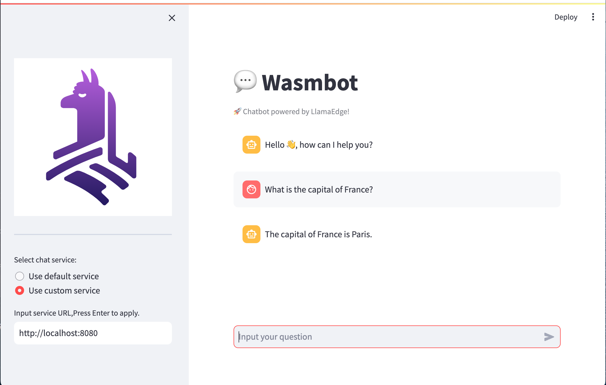

# Chat Bot


This is a GUI based chat bot app. It allows you to run LLMs locally.

## Usage

### Run on `LlamaEdgeChatService`

- Prepare LlamaEdge API server

  The `run-llm.sh` script provides a convenient way to download LLM models and llama-chat.wasm, deploy WasmEdge Runtime and the `wasi-nn_ggml` plguin. Run the following command to download `run-llm.sh` and execute it:

  ```console
  bash <(curl -sSfL 'https://code.flows.network/webhook/iwYN1SdN3AmPgR5ao5Gt/run-llm.sh')
  ```

  Follow the prompts to select the LLM model you want to use, install WasmEdge Runtime, download LlamaEdge API server, set server options, and finally start up the server.

- Git clone the repo

  ```console
  git clone https://github.com/second-state/wasm-llm
  cd wasm-bot
  ```

- Install dependencies

  - Install miniconda
    Refer to [Quick command line install](https://docs.conda.io/projects/miniconda/en/latest/#quick-command-line-install) to install miniconda on your local system.

  - Create a conda environment

    ```console
    # create a conda environment named chatbot
    conda create -n chatbot python=3.11

    # activate the environment
    conda activate chatbot
    ```

  - Install dependencies

    ```console
    pip install -r requirements.txt
    ```

- Execute chatbot

  - Start the chatbot

    ```console
    streamlit run service.py
    ```

    If the chatbot is started successfully, you will see the following message:

    ```console
    You can now view your Streamlit app in your browser.

    Local URL: http://localhost:8501
    Network URL: http://192.168.0.103:8501
    ```

    And you may see a web page similar to the snapshot below opened in your browser:

    

- Connect chatbot to LlamaEdge server

  To connect the chatbot to the LlamaEdge server, you need to set the `Select chat service` option in the web page to the IP address of the LlamaEdge server. For example, assume that the IP address and the port of the LlamaEdge server is `127.0.0.1:8080`, then you need to select `User custom service` option, input the service url: `http://localhost:8080` and press **Return**. The following snapshot shows the chatbot connected to the local LlamaEdge server:

  

- Let's chat

  Now you can chat with the chatbot. For example, you can input `What is the capital of France?` and press **Return**. The chatbot will reply your question:

  
