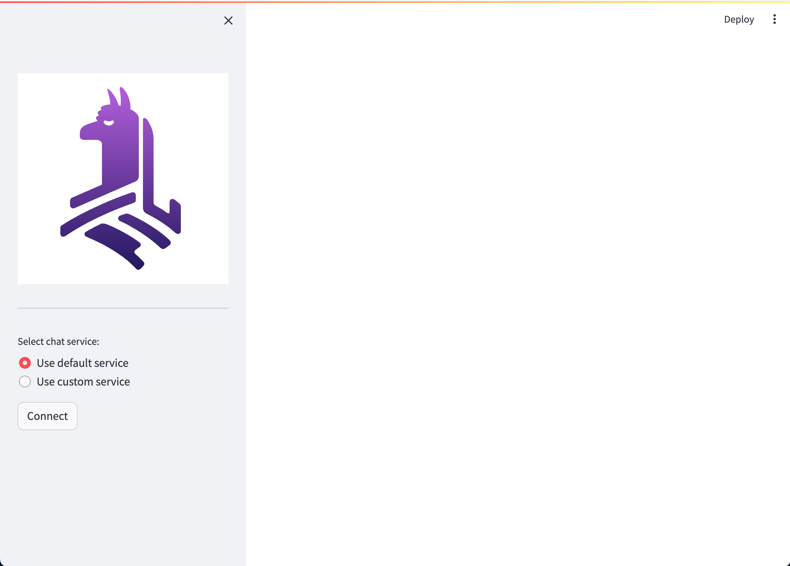
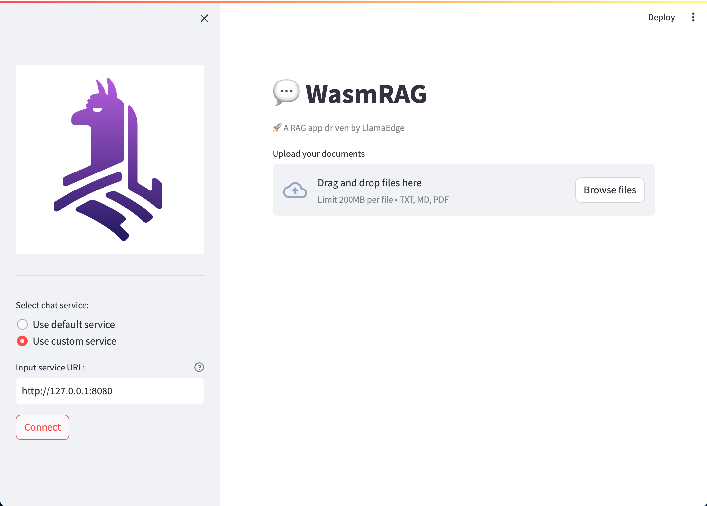

# WasmRAG

## Prepare Environment

### Deploy LlamaEdge API server

  The [run-llm.sh](https://github.com/second-state/LlamaEdge/raw/main/run-llm.sh) script provides an interactive way to deploy LlamaEdge API server. Run the following command and follow the prompts to download required assets and start up the LlamaEdge API server:

  ```console
  bash <(curl -sSfL 'https://code.flows.network/webhook/iwYN1SdN3AmPgR5ao5Gt/run-llm.sh')
  ```

  [>> Click to watch Youtube video of Deploying LlamaEdge API Server with run-llm script <<](https://www.youtube.com/watch?v=fu_sM4uSLsI)

  Note that not all LLMs are suitable for RAG. The following LLMs are known to work with RAG:

  - [second-state/Llama-2-13B-Chat-GGUF](https://huggingface.co/second-state/Llama-2-13B-Chat-GGUF)

### Git clone the repo

  ```console
  git clone https://github.com/second-state/wasm-llm
  cd wasm-rag-service
  ```

### Install dependencies

- Install miniconda

  Refer to [Quick command line install](https://docs.conda.io/projects/miniconda/en/latest/#quick-command-line-install) to install miniconda on your local system.

- Create a conda environment

  ```bash
  # create a conda environment named wasm-rag
  conda create -n wasm-rag python=3.11

  # activate the conda environment
  conda activate wasm-rag
  ```

- Install dependencies using `pip`

  ```bash
  cd wasm-rag-service
  pip install -r requirements.txt
  ```

## Usage

### Execute WasmRAG app

- Start WasmRAG app

  ```console
  cd wasm-rag-service

  streamlit run app.py
  ```

  If the app is started successfully, you will see the following message in the console:

  ```console
  You can now view your Streamlit app in your browser.

  Local URL: http://localhost:8501
  Network URL: http://192.168.0.103:8501
  ```

  In addition, a web page will be opened in your default browser:

  <div align="center">
  
  </div>

- Connect WasmRAG to LlamaEdge server

  To connect WasmRAG to the LlamaEdge server, you need to set the `Select chat service` option in the web page to the IP address of the LlamaEdge server. For example, assume that the IP address and the port of the LlamaEdge server is `127.0.0.1:8080`, then you need to select `User custom service` option, input the service url: `http://localhost:8080`, and then press **Connect**. The following snapshot shows the chatbot connected to the local LlamaEdge server:

  <div align="center">
  
  </div>

- Let's chat

  The following link leads to a Youtube video that shows how to chat with WasmRAG:

  [>> Click to watch Youtube video of Chatting with WasmRAG <<](https://www.youtube.com/watch?v=cZclR9VK3B8)

<!--
### Install Python packages

```bash
cd wasm-rag-service
pip install -r requirements.txt
```

### Install system dependencies

- Install the following system dependencies if they are not already available on your system. Depending on what document types you're parsing, you may not need all of these.

  - `libmagic-dev` (filetype detection)
  - `poppler-utils` (images and PDFs)
  - `tesseract-ocr` (images and PDFs, install tesseract-lang for additional language support)
  - `libreoffice` (MS Office docs)
  - `pandoc` (EPUBs, RTFs and Open Office docs)
 -->
